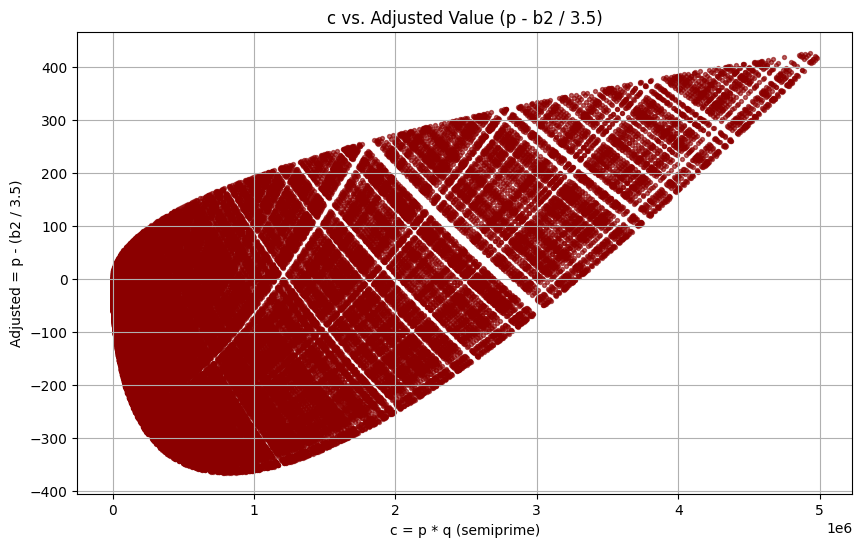

# Semiprime Droplet Visualization

A small exploration in *experimental number theory* — plotting semiprimes `c = p * q` (product of two primes) against an adjusted transformation

\[
Y = p - \frac{b_2}{t}, \quad b_2 = 2 \lfloor \sqrt{2c} \rfloor
\]

reveals an unexpectedly smooth, tilted “droplet” shape with diagonal banding.



---

## 🧩 Motivation

When you plot `c` vs `p - (b₂ / 3.5)` for all semiprimes under a few million, the points self-organize into a **tilted teardrop** with crisp diagonal stripes.  
The code here investigates where that pattern comes from — and it turns out it’s not random.

### Key observations

| Feature | Mathematical Cause |
|----------|--------------------|
| Outer droplet envelope | from \(p \le q\) and \(b_2 \approx 2\sqrt{2c}\), giving \(Y_{max} \approx (1 - 2\sqrt2/t)\sqrt c\) |
| Straight diagonal bands | quantization of \(b_2 = 2\lfloor \sqrt{2c} \rfloor\) (step size ≈ 2/t ≈ 0.571) |
| Oblique sub-bands | arithmetic families with one prime nearly fixed |
| Smooth boundary even without floor | same analytic hull; only internal stripes vanish |

The phenomenon is similar in spirit to the **Ulam spiral** or other visual emergences in number theory.

---

## 🧮 How to Run

### Requirements
Python ≥ 3.9, with:

```bash
pip install numpy matplotlib
